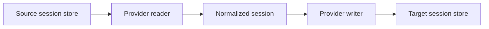

<div align="center">

<h1>harness-bridge</h1>

<p>Convert coding sessions into another harness's native format, ready to continue.</p>

<p><strong>DeepSeek Harness · Codex Desktop / CLI · Claude Code · ZCode · agy</strong></p>

[![Release][release-badge]][releases]
[![License][license-badge]](LICENSE)
[![Rust][rust-badge]](https://www.rust-lang.org/)

<p>
  <a href="#quick-start">Quick start</a> ·
  <a href="#compatibility">Compatibility</a> ·
  <a href="docs/development.md">Development</a> ·
  <a href="https://github.com/ahnafnafee/harness-bridge/issues">Report an issue</a>
</p>

</div>

---

`harness-bridge` reads a local session, converts its messages and tool activity through a shared model, and writes a session the destination harness can open. The source stays intact, so you can continue either copy independently.

The visible transcript and the context sent to the model are preserved separately. Supported source checkpoints keep superseded history out of the next request, and an import preflight checks retained context size before writing. Saved child sessions can be imported together with translated parent links.

<details>
<summary><kbd>Table of contents</kbd></summary>

- [Install](#install)
- [Quick start](#quick-start)
- [Move a session to another machine](#move-a-session-to-another-machine)
- [Compatibility](#compatibility)
- [Options](#options)
- [How conversion works](#how-conversion-works)
- [Resuming in Codex](#resuming-in-codex)
- [Child sessions](#child-sessions)
- [Common questions](#common-questions)
- [Development](#development)
- [License](#license)

</details>

## Install

Download a binary from [Releases][releases], or build from source with a current stable Rust toolchain:

```sh
git clone https://github.com/ahnafnafee/harness-bridge.git
cd harness-bridge
cargo install --locked --path .
```

Release archives target Windows x64, Linux x64, and macOS Apple Silicon. Local validation is Windows-first. The installed command does not require Python or Node; Python is used only by the optional development probe.

## Quick start

List sessions, select an id prefix or title, and preview the conversion:

```sh
harness-bridge list --provider dsh
harness-bridge migrate "<id-prefix>" --from dsh --to codex --dry-run
```

Then write the native session:

```sh
harness-bridge migrate "<id-prefix>" --from dsh --to codex
```

The result reports the destination path, native session id, and conversion counts. DSH and Codex are the default source and target, so `harness-bridge migrate "<id-prefix>"` is equivalent.

Set the new chat's directory and title when needed. For example, in PowerShell:

```powershell
harness-bridge migrate "API migration" --cwd "F:\Projects\my-app" --name "API migration"
```

Other supported directions use the same command:

```sh
harness-bridge migrate "<id-prefix>" --from codex --to claude
harness-bridge migrate "<id-prefix>" --from claude --to dsh
harness-bridge migrate "<id-prefix>" --from zcode --to codex
harness-bridge migrate "<id-prefix>" --from agy --to codex
```

If a query matches several sessions, the command lists their ids and stops. Use a longer id prefix to select the intended session.

## Move a session to another machine

On the source PC, export a versioned portable JSON file. Add `--include-subagents` to carry saved child sessions and their links:

```sh
harness-bridge export "API migration" --from zcode --output session.hbridge.json --include-subagents
```

Copy that file to the other PC and install harness-bridge 0.3.0 or later there. You can build the current version directly from this repository:

```sh
cargo install --locked --git https://github.com/ahnafnafee/harness-bridge
```

Choose the destination harness and its project directory, then preview and import:

```powershell
harness-bridge import session.hbridge.json --to codex --cwd "D:\Projects\my-app" --dry-run
harness-bridge import session.hbridge.json --to codex --cwd "D:\Projects\my-app"
```

Both commands support all five harnesses. Import reads the transfer file without needing the source harness's home or database. Every included child is imported automatically, with destination ids and parent links recomputed on the receiving PC. The transcript, original timestamps, tool pairs, and retained resume context travel together. Context budgeting, opt-in pruning, and portable reasoning replay apply during import.

If import reports an oversized retained context, add `--prune-resume-context` to the preview/import commands to shorten reasoning and tool outputs while keeping the archive, or compact the source and export again.

Export refuses to overwrite an existing file; `export --dry-run` reports its counts without creating it. Import validates the format version, payload checksum, and family graph before converting. The receiving harness must already be initialized: Codex needs a local top-level Desktop session as a template, ZCode needs its database, and agy needs a template conversation. Existing provider constraints still apply.

The file carries conversation data, including recorded paths and text, rather than project files, attachments, credentials from harness settings, or executable hidden model state. Move the project separately. `--cwd` changes the new base directory while paths inside the history remain as recorded. Reimporting uses deterministic destination ids and can overwrite later destination turns, as with `migrate`.

See the [portable format specification](docs/portable-format.md) for version 1's layout and validation rules.

## Compatibility

| Provider | Read | Write | Native format and constraints |
| :-- | :--: | :--: | :-- |
| **dsh** | Yes | Yes | Version 4 JSONL, including multi-frame zstd input. Converted sessions use plain JSONL. |
| **Codex** | Yes | Yes | Rollout JSONL, desktop sidebar registration, and an import ledger. Writes require an existing top-level Desktop session as a template. |
| **Claude Code** | Yes | Yes | Project JSONL with compact boundaries, tool-use, and tool-result blocks. Active foreign reasoning becomes plain text; harness instructions are omitted because there is no developer channel. |
| **ZCode** | Yes | Yes | SQLite session, message, and part tables. Writes use the destination database. |
| **agy** | Yes | Yes, text turns | Brain transcripts with a protobuf fallback reader. Writes rebuild a template conversation's native steps and indexes; unsupported tool activity is retained in a separate migration archive. |

Messages, reasoning, tool pairs, timestamps, and stored summaries pass through the shared session model where the target can represent them. Provider-specific telemetry and unsupported records are not guaranteed to survive a round trip. Attachment and media transfer is not implemented.

## Options

| Option | Purpose |
| :-- | :-- |
| `--from`, `--to` | Source and destination: `dsh`, `codex`, `claude`, `zcode`, or `agy`. |
| `--cwd` | Set the destination's base directory; defaults to the source directory. Paths inside messages are left as recorded. |
| `--name` | Override the destination's display title. |
| `--dry-run` | Read and convert without writing. Required target templates are still read. |
| `--resume-max-chars` | Retained-context character budget; defaults to 750,000. This is a preflight limit, not a token count. |
| `--prune-resume-context` | Explicitly allow shortening reasoning and tool outputs to fit the budget. Preserve the complete normalized archive, prompts, assistant text, tool arguments and call ids. |
| `--include-subagents` | Import saved children recursively, preflight the entire family, and remap parent links. |
| `--preset` | Copy a DSH session to an installed directory preset; valid only with `--from dsh --to dsh`. |
| `--dsh-home`, `--codex-home`, `--claude-home` | Override a provider's home directory, including for isolated validation. |
| `--zcode-db`, `--agy-dir` | Override ZCode's database or agy's data directory. |

Run `harness-bridge --help` or `harness-bridge migrate --help` for the full command reference.

<details>
<summary><strong>Default storage locations</strong></summary>

Paths are relative to the user's home directory.

| Provider | Location |
| :-- | :-- |
| dsh | `~/.dsh/sessions/<project>/<id>/session.v4.jsonl[.zstd]` |
| Codex | `~/.codex/sessions/YYYY/MM/DD/rollout-*.jsonl` |
| Claude Code | `~/.claude/projects/<project>/<id>.jsonl` |
| ZCode | `~/.zcode/cli/db/db.sqlite` |
| agy | `~/.gemini/antigravity-cli` |

</details>

## How conversion works



Every provider implements discovery, reading, writing, and child discovery. The shared [session model](src/ir.rs) carries the archive and, when available, a separate set of events representing the source's current model context. The destination writer translates those records into native messages and tool items, then performs any registration its app needs. Claude and DSH writes add native context checkpoints; ZCode keeps archival messages visible in the transcript but hidden from the provider. agy writes retained text turns and stores the normalized archive separately in `brain/<id>/migration-archive.json`.

Codex writes also update `session_index.jsonl`, the `threads` table in `state_5.sqlite` when present, and `dsh-imports.json`. This lets the Desktop app find imported chats without relying on its initial rollout backfill.

## Resuming in Codex

Source transcripts can retain records from before compaction. Sending that entire log on resume can exceed the model's context window. Claude's latest compact boundary, summary and declared preserved messages, DSH's ordered surface replacements, Codex's plaintext replacement history, and ZCode's persisted summaries are read as retained context.

The DSH reader replays `surfaceOp` replacements in their actual context order and retains the tool calls paired with surviving results. The Codex writer keeps the full converted transcript for display and adds a native `compacted` record containing the retained context. Migration output reports `resume_context_items` and `resume_context_chars` when this metadata is available.

Imported reasoning remains visible in the Codex transcript, while the resume checkpoint represents it as labeled assistant text. The normalized model cannot transfer the originating service's signed or encrypted hidden state. This applies to every source provider, including uncompacted sessions and normalized Codex reads. Replaying synthesized native reasoning can otherwise cause `unsupported_persisted_item_context` on a later response continuation.

Compacted DSH transcripts without authoritative surface operations and Codex checkpoints without plaintext replacement history fail with an explanation instead of replaying the archive. Uncompacted sources use their full context and the same size preflight.

When retained context exceeds the budget, compact the source or explicitly allow output pruning:

```sh
harness-bridge migrate "<id-prefix>" --from claude --to codex --prune-resume-context --include-subagents --dry-run
```

Pruning retains a notice and the beginning/end of shortened tool outputs; it is not a generated summary. If protected messages or arguments still exceed the budget, the import stops before writing. `--resume-max-chars` can be adjusted for a suitable destination model. Counts describe serialized normalized context, not the destination's exact request or token usage; native instructions, tool catalogs and model limits still affect whether a remote request fits.

After importing or updating a chat, reopen or refresh Codex Desktop so it reloads the rollout and registry. For a chat already loaded in memory, restart the app before resuming.

`python scripts/verify_codex_resume.py <rollout> --codex <executable>` tests an isolated copy with the real app-server and a local Responses stub. It checks request size and unsigned reasoning across a harmless plan-tool continuation. Custom HTTP providers may send full history instead of `previous_response_id`; the probe reports which mode it observed. This local replay contract makes no remote model calls and does not establish acceptance by the remote service.

## Child sessions

`--include-subagents` imports saved child conversations, including nested descendants, and reports their destination ids under `extra.child_sessions`. All members are read and converted in dry-run mode before any actual write. Reimports use deterministic ids. A failure during a later filesystem or registry write can still leave earlier family members written; there is no transaction across separate stores.

The full child-id map is kept in the parent's preserved transcript, alongside native parent links and the command's output. It does not enlarge the parent's model context or trigger additional pruning.

| Destination | Parent link |
| :-- | :-- |
| Codex | Native parent metadata and historical `thread_spawn_edges` when available. |
| Claude Code | Native `subagents/agent-<id>.jsonl` under the translated parent path. |
| DSH | Native `parentSession` header. |
| ZCode | Native `parent_id` when available; migration entry fallback on older schemas. |
| agy | Portable parent link in the migration archive; native subtrajectory translation is not implemented. |

These are historical sessions. Importing them does not start agents or translate destination tool commands. Child discovery uses persisted native links for Codex, Claude, DSH and ZCode; for agy it can recover only links recorded by previous bridge imports. Whether children appear in an app's UI depends on that app.

## Common questions

<details>
<summary><strong>Does migration modify the source?</strong></summary>

No. Conversion reads the source and writes to the destination. A DSH preset change also creates a separate session with a deterministic id.

</details>

<details>
<summary><strong>What happens if I run the same migration again?</strong></summary>

Target ids are deterministic, and the Codex import ledger remembers earlier imports. Repeating a migration updates the same target instead of creating another copy. It can overwrite conversation added in the destination since the previous import; preserve that copy before reimporting.

</details>

<details>
<summary><strong>Can I test against an isolated store?</strong></summary>

Yes. Use the home overrides and `--dry-run`. For a real isolated Codex write, copy an existing top-level Desktop rollout into the test home's `sessions` directory as a template. For ZCode, use a database copy with `--zcode-db`. See [local validation](docs/development.md#local-validation).

</details>

<details>
<summary><strong>Why is an imported Codex chat missing from the sidebar?</strong></summary>

Desktop needs both the rollout and its registry entry. This tool registers the chat during a normal write; manually copying a rollout may not be enough. Refresh or reopen the app after migration.

</details>

## Development

Run the local Rust checks:

```sh
cargo fmt --all -- --check
cargo test --locked
```

The [development guide](docs/development.md) covers module ownership, provider work, and the real Codex app-server resume probe. Contributor guidance for running migrations is in [AGENTS.md](AGENTS.md).

Current gaps include agy tool steps, attachment transfer, broader platform validation, and a built-in `verify` command.

## License

[MIT](LICENSE).

<div align="right">

[Back to top](#harness-bridge)

</div>

[release-badge]: https://img.shields.io/github/v/release/ahnafnafee/harness-bridge?style=flat-square&labelColor=30343b&color=58616c
[license-badge]: https://img.shields.io/badge/license-MIT-58616c?style=flat-square&labelColor=30343b
[rust-badge]: https://img.shields.io/badge/Rust-stable-58616c?style=flat-square&labelColor=30343b
[releases]: https://github.com/ahnafnafee/harness-bridge/releases
