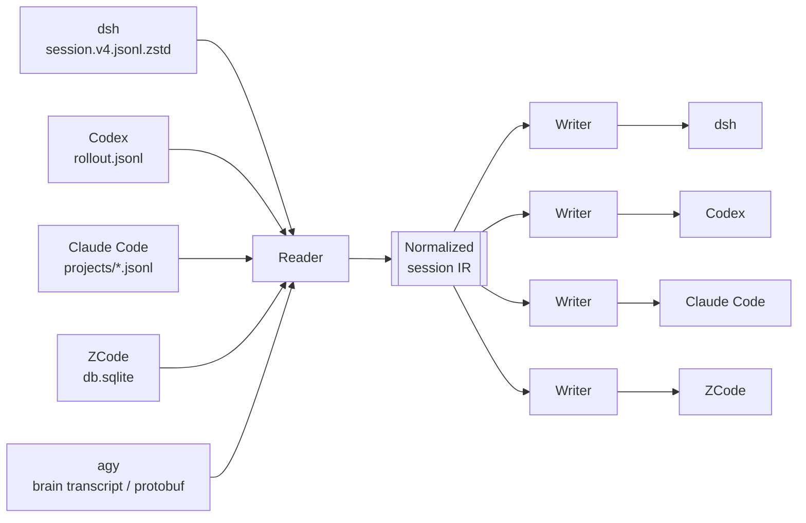

<div align="center">

# 🌉 harness-bridge

**Move your coding-agent sessions between harnesses — without losing a single tool call.**

DeepSeek Harness · Codex Desktop · Claude Code · ZCode · agy

[](LICENSE)
[](https://www.rust-lang.org/)
[](#)
[](https://github.com/ahnafnafee/harness-bridge/releases/latest)
[](https://github.com/ahnafnafee/harness-bridge/actions/workflows/ci.yml)

</div>

---

Your conversations with coding agents are locked inside each tool's private store — zstd-compressed event logs, opaque SQLite databases, protobuf blobs. `harness-bridge` opens them all, converts them through one normalized session model, and writes them back in whatever harness you want to continue in.

Built out of a real migration: a 1,580-event session moved from DeepSeek Harness into Codex Desktop, byte-for-byte faithful, resumable mid-conversation.

## ✨ Features

- 🔀 **Five harnesses, one command** — read a session from any supported tool and land it in any other.
- 🧬 **Lossless where it matters** — every user prompt, assistant reply, reasoning trace, tool call, and tool result is carried through the normalized model, with original timestamps.
- 🖥️ **Threads appear in the target app** — writing to Codex Desktop registers the thread in `session_index.jsonl` *and* the desktop app's `state_5.sqlite` registry (its one-shot backfill otherwise ignores new files forever).
- 🔁 **Idempotent** — a migration ledger (`~/.codex/dsh-imports.json`, shared with the original Python migration) remembers what's been moved; re-running updates in place instead of duplicating.
- 🧪 **`--dry-run`** — full conversion against a throwaway home, nothing written.
- ⚡ **Fast** — Rust, pure-Rust zstd (multi-frame), no external dependencies at runtime.
- 🩹 **Handles real-world mess** — multi-frame zstd transcripts, duplicate tool results, spliced inbox messages, compaction summaries, seeded subagent history.

## 📦 Install

```bash
git clone https://github.com/ahnafnafee/harness-bridge
cd harness-bridge
cargo install --path .
```

Requires Rust 1.75+. Everything is static — no Python, no Node, no runtime deps.

## 🚀 Quick start

```bash
# See everything that's migratable
harness-bridge list

# Move a session by title or id prefix (dsh -> Codex Desktop by default)
harness-bridge migrate warlock-crack

# Pick a different base directory for the new thread
harness-bridge migrate warlock-crack --cwd "F:\\Miscellaneous\\GitHub\\gve-site"

# Any direction works
harness-bridge migrate 01a1058c --from codex --to dsh
harness-bridge migrate 456f0420 --from dsh --to claude
harness-bridge migrate "Image Analysis" --from agy --to codex

# Rehearse without touching anything
harness-bridge migrate warlock-crack --dry-run
```

## 🧭 How it works



Each provider implements three operations: **discover** (list sessions + titles), **read** (native → IR), **write** (IR → native). The IR preserves roles, tool call/result pairing, reasoning text, compaction summaries, source-kind tags, and original timestamps — so a session keeps its shape wherever it lands.

## 🔄 Provider support

| Harness | Read | Write | Notes |
|---|---|---|---|
| **dsh** (DeepSeek Harness) | ✅ | ✅ | Reads multi-frame `.jsonl.zstd`; writes plain JSONL (dsh reads both). Subagent/seeded sessions supported. |
| **Codex Desktop / CLI** | ✅ | ✅ | Desktop-shaped rollouts + sidebar registration + import ledger. Validated against the real app-server. |
| **Claude Code** | ✅ | ✅ | `~/.claude/projects/<slug>/<uuid>.jsonl`; thinking blocks, tool_use/tool_result preserved. |
| **ZCode** | ✅ | ✅ | SQLite `session`/`message`/`part` tables; writes are WAL-safe. |
| **agy** (Antigravity CLI) | ✅ | ✅ | Read: brain transcripts, falling back to the community-documented protobuf step map. Write: **native** — rebuilds the conversation's `steps` table at the protobuf wire level (template-clone), registers the summaries index, brain transcripts and title. Text turns today; tool-call steps are a tracked follow-up. |

### Fidelity notes

- **dsh → Codex**: validated against a known-good reference migration — all 880 model-context records and all 9 turn contexts byte-identical; UI display records identical except tool calls whose source emitted duplicate results (harness-bridge shows the merged output text).
- **Roles**: harness-injected context (time check-ins, skill catalogs, system prompts) becomes Codex `developer` messages — kept in the model's context, hidden from the chat transcript. Claude Code has no developer channel, so those notes are dropped there (documented, intentional).
- **`--cwd` changes only the new session's base directory** — conversation content is never rewritten, so file paths in history keep pointing at the original directories.

## 🖥️ The Codex Desktop gotcha

Codex Desktop's sidebar reads a `threads` table in `~/.codex/state_5.sqlite`. That table is filled by a **one-time backfill that marks itself complete** — rollout files added later are never discovered, even after restarting the app. harness-bridge registers the thread there for you (plus `session_index.jsonl` for the name). If a thread you imported with another tool is missing from the sidebar, that's why.

## ❓ FAQ

<details>
<summary><b>Is this safe to run against my live installs?</b></summary>

Reads never modify the source. Writes are additive: new rollout files, new session rows, ledger updates — and a one-time backup of `session_index.jsonl`. Use `--dry-run` to rehearse. ZCode writes go into its live database (WAL, brief locks); copy `db.sqlite` first if you want zero risk.
</details>

<details>
<summary><b>Why does my migrated Codex thread show up only after a restart… or not at all with other tools?</b></summary>

See the gotcha above — the desktop app only lists threads registered in its state database. harness-bridge handles it; manual file drops don't.
</details>

<details>
<summary><b>Can I keep using the session in the original harness afterwards?</b></summary>

Yes. Nothing is moved — sessions are converted and copied. Both sides keep working independently.
</details>

<details>
<summary><b>Multiple sessions share a title?</b></summary>

`migrate` refuses to guess and lists the matching ids. Use an id prefix: `harness-bridge migrate 456f0420`.
</details>

## 🔎 Related tools

Kindred projects the survey turned up — each solves a different slice of the problem:

- **[Antigravity Format Reverse-Engineered](https://gist.github.com/ArcticWinterSturm/718637afb3094814a94dc77261e0b5e0)** — the community step-type map for agy's protobuf conversation DBs; the basis of our agy fallback reader.
- **[Antigravity-Legacy-Migrator](https://github.com/Tauqueer12/Antigravity-Legacy-Migrator)** — migrates legacy Antigravity IDE `.pb` histories into the new SQLite format (IDE-internal, not cross-harness).
- **[agentgrep](https://agentgrep.org/backends/antigravity-cli/)** — searchable index over agent sessions incl. Antigravity CLI artifacts.
- **[antigravity_decryptor](https://deepwiki.com/arashz/antigravity_decryptor/8.2-protobuf-wire-format-parsing)** — schema-less protobuf wire parsing for Antigravity data.
- **Codex `/import`** — Codex CLI's built-in importer for Claude Code / Cursor chats (config + recent chats; not a general harness-to-harness transcript converter).
- **authsec.ai session transfer** — moves session *context summaries* between Claude Code, Codex and Gemini.
- **Contextify** — indexes Claude Code + Codex sessions into one searchable local database (recall, not migration).

harness-bridge differs by doing **native, resumable writes** on both ends of the pipe — not exports to markdown, not summaries, not single-harness format upgrades.

## 🗺️ Roadmap

- [ ] macOS/Linux home paths (currently Windows-first)
- [ ] agy write: tool-call steps (text turns ship natively since v0.2.0)
- [ ] `verify` subcommand wrapping the Codex app-server round-trip
- [ ] Attachment/media carrying across providers

## 🤝 Contributing

Provider implementations are self-contained under `src/providers/` — a new harness needs one file implementing `discover` / `read` / `write` against [`src/ir.rs`](src/ir.rs). PRs welcome.

## 📄 License

MIT — see [LICENSE](LICENSE).

---

<div align="center">

**Built with [ZCode](https://z.ai)** · sessions belong to you, not to the tool that made them

</div>
