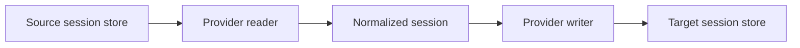

<div align="center">

<h1>harness-bridge</h1>

<p>Convert coding sessions into another harness's native format, ready to continue.</p>

<p><strong>DeepSeek Harness · Codex Desktop / CLI · Claude Code · ZCode · agy</strong></p>

[![Release][release-badge]][releases]
[![License][license-badge]](LICENSE)
[![Rust][rust-badge]](https://www.rust-lang.org/)

<p>
  <a href="#quick-start">Quick start</a> ·
  <a href="#compatibility">Compatibility</a> ·
  <a href="docs/development.md">Development</a> ·
  <a href="https://github.com/ahnafnafee/harness-bridge/issues">Report an issue</a>
</p>

</div>

---

`harness-bridge` reads a local session, converts its messages and tool activity through a shared model, and writes a session the destination harness can open. The source stays intact, so you can continue either copy independently.

For DSH → Codex migrations, the visible transcript and the context sent to the model are preserved separately. DSH's compaction summaries and pruned outputs become a native Codex resume checkpoint, keeping superseded history out of the next request.

<details>
<summary><kbd>Table of contents</kbd></summary>

- [Install](#install)
- [Quick start](#quick-start)
- [Compatibility](#compatibility)
- [Options](#options)
- [How conversion works](#how-conversion-works)
- [Resuming in Codex](#resuming-in-codex)
- [Common questions](#common-questions)
- [Development](#development)
- [License](#license)

</details>

## Install

Download a binary from [Releases][releases], or build from source with a current stable Rust toolchain:

```sh
git clone https://github.com/ahnafnafee/harness-bridge.git
cd harness-bridge
cargo install --locked --path .
```

Release archives target Windows x64, Linux x64, and macOS Apple Silicon. Local validation is Windows-first. The installed command does not require Python or Node; Python is used only by the optional development probe.

## Quick start

List sessions, select an id prefix or title, and preview the conversion:

```sh
harness-bridge list --provider dsh
harness-bridge migrate "<id-prefix>" --from dsh --to codex --dry-run
```

Then write the native session:

```sh
harness-bridge migrate "<id-prefix>" --from dsh --to codex
```

The result reports the destination path, native session id, and conversion counts. DSH and Codex are the default source and target, so `harness-bridge migrate "<id-prefix>"` is equivalent.

Set the new chat's directory and title when needed. For example, in PowerShell:

```powershell
harness-bridge migrate "API migration" --cwd "F:\Projects\my-app" --name "API migration"
```

Other supported directions use the same command:

```sh
harness-bridge migrate "<id-prefix>" --from codex --to claude
harness-bridge migrate "<id-prefix>" --from claude --to dsh
harness-bridge migrate "<id-prefix>" --from zcode --to codex
harness-bridge migrate "<id-prefix>" --from agy --to codex
```

If a query matches several sessions, the command lists their ids and stops. Use a longer id prefix to select the intended session.

## Compatibility

| Provider | Read | Write | Native format and constraints |
| :-- | :--: | :--: | :-- |
| **dsh** | Yes | Yes | Version 4 JSONL, including multi-frame zstd input. Converted sessions use plain JSONL. |
| **Codex** | Yes | Yes | Rollout JSONL, desktop sidebar registration, and an import ledger. Writes require an existing top-level Desktop session as a template. |
| **Claude Code** | Yes | Yes | Project JSONL with thinking, tool-use, and tool-result blocks. Harness instructions are omitted because there is no developer channel. |
| **ZCode** | Yes | Yes | SQLite session, message, and part tables. Writes use the destination database. |
| **agy** | Yes | Yes, text turns | Brain transcripts with a protobuf fallback reader. Writes rebuild a template conversation's native steps and indexes; tool calls and results are omitted. |

Messages, reasoning, tool pairs, timestamps, and stored summaries pass through the shared session model where the target can represent them. Provider-specific telemetry and unsupported records are not guaranteed to survive a round trip. Attachment and media transfer is not implemented.

## Options

| Option | Purpose |
| :-- | :-- |
| `--from`, `--to` | Source and destination: `dsh`, `codex`, `claude`, `zcode`, or `agy`. |
| `--cwd` | Set the destination's base directory; defaults to the source directory. Paths inside messages are left as recorded. |
| `--name` | Override the destination's display title. |
| `--dry-run` | Read and convert without writing. Required target templates are still read. |
| `--preset` | Copy a DSH session to an installed directory preset; valid only with `--from dsh --to dsh`. |
| `--dsh-home`, `--codex-home`, `--claude-home` | Override a provider's home directory, including for isolated validation. |
| `--zcode-db`, `--agy-dir` | Override ZCode's database or agy's data directory. |

Run `harness-bridge --help` or `harness-bridge migrate --help` for the full command reference.

<details>
<summary><strong>Default storage locations</strong></summary>

Paths are relative to the user's home directory.

| Provider | Location |
| :-- | :-- |
| dsh | `~/.dsh/sessions/<project>/<id>/session.v4.jsonl[.zstd]` |
| Codex | `~/.codex/sessions/YYYY/MM/DD/rollout-*.jsonl` |
| Claude Code | `~/.claude/projects/<project>/<id>.jsonl` |
| ZCode | `~/.zcode/cli/db/db.sqlite` |
| agy | `~/.gemini/antigravity-cli` |

</details>

## How conversion works



Every provider implements discovery, reading, and writing. The shared [session model](src/ir.rs) carries the archive and, when available, a separate set of events representing the source's current model context. The destination writer translates those records into native messages and tool items, then performs any registration its app needs.

Codex writes also update `session_index.jsonl`, the `threads` table in `state_5.sqlite` when present, and `dsh-imports.json`. This lets the Desktop app find imported chats without relying on its initial rollout backfill.

## Resuming in Codex

DSH transcripts are append-only: a compacted summary or pruned tool output can replace earlier context while the original records remain in the file. Sending that entire log on resume can exceed the model's context window.

The DSH reader replays `surfaceOp` replacements in their actual context order and retains the tool calls paired with surviving results. The Codex writer keeps the full converted transcript for display and adds a native `compacted` record containing the retained context. Migration output reports `resume_context_items` and `resume_context_chars` when this metadata is available.

Older DSH transcripts without surface operations use the full-history fallback. The retained context must still fit the selected model; character counts are diagnostic figures, not token counts.

After importing or updating a chat, reopen or refresh Codex Desktop so it reloads the rollout and registry. For a chat already loaded in memory, restart the app before resuming.

## Common questions

<details>
<summary><strong>Does migration modify the source?</strong></summary>

No. Conversion reads the source and writes to the destination. A DSH preset change also creates a separate session with a deterministic id.

</details>

<details>
<summary><strong>What happens if I run the same migration again?</strong></summary>

Target ids are deterministic, and the Codex import ledger remembers earlier imports. Repeating a migration updates the same target instead of creating another copy. It can overwrite conversation added in the destination since the previous import; preserve that copy before reimporting.

</details>

<details>
<summary><strong>Can I test against an isolated store?</strong></summary>

Yes. Use the home overrides and `--dry-run`. For a real isolated Codex write, copy an existing top-level Desktop rollout into the test home's `sessions` directory as a template. For ZCode, use a database copy with `--zcode-db`. See [local validation](docs/development.md#local-validation).

</details>

<details>
<summary><strong>Why is an imported Codex chat missing from the sidebar?</strong></summary>

Desktop needs both the rollout and its registry entry. This tool registers the chat during a normal write; manually copying a rollout may not be enough. Refresh or reopen the app after migration.

</details>

## Development

Run the local Rust checks:

```sh
cargo fmt --all -- --check
cargo test --locked
```

The [development guide](docs/development.md) covers module ownership, provider work, and the real Codex app-server resume probe. Contributor guidance for running migrations is in [AGENTS.md](AGENTS.md).

Current gaps include agy tool steps, attachment transfer, broader platform validation, and a built-in `verify` command.

## License

[MIT](LICENSE).

<div align="right">

[Back to top](#harness-bridge)

</div>

[release-badge]: https://img.shields.io/github/v/release/ahnafnafee/harness-bridge?style=flat-square&labelColor=30343b&color=58616c
[license-badge]: https://img.shields.io/badge/license-MIT-58616c?style=flat-square&labelColor=30343b
[rust-badge]: https://img.shields.io/badge/Rust-stable-58616c?style=flat-square&labelColor=30343b
[releases]: https://github.com/ahnafnafee/harness-bridge/releases
